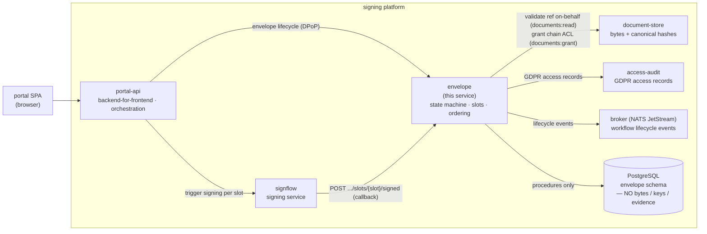
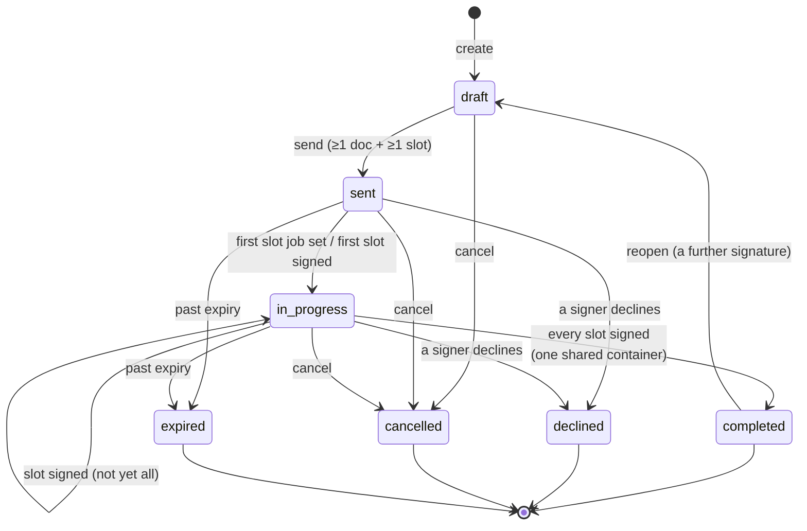
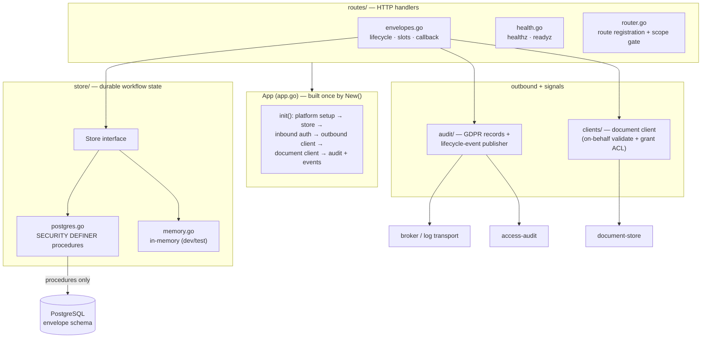
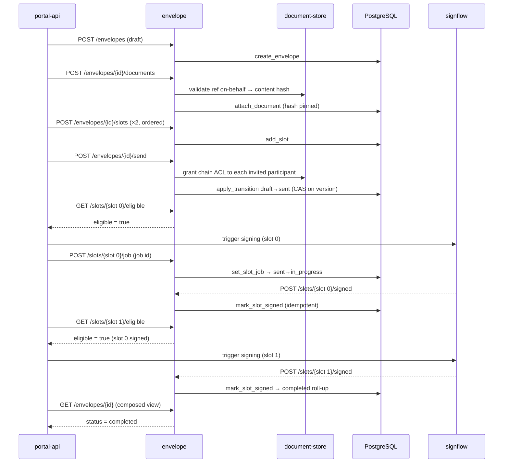

# envelope

The **workflow brain** of the signing platform — the multi-document, multi-signer **Envelope/Workflow service**. It owns the `envelope` and its `signer_slot`s, runs the envelope **state machine** (`draft → sent → in_progress → completed | declined | expired | cancelled`), enforces signing **order**, and is the durable record of *who must sign what, in what order, and where each slot stands*. Every state change is decided in the service and applied atomically by a data-layer procedure under an **optimistic-concurrency compare-and-set** on the envelope version, so concurrent owner actions and the signing service's callback can never lose or double a transition.

It holds **no document bytes**, **no signing keys or crypto**, and **no signature evidence** — those live in their own services; this one references documents and signing jobs by plain id. A document reference is validated at attach time **on behalf of the signing user** (so the service only ever sees the user's own documents), and the document's content hash is **pinned** then, to enforce the "every party signs the same document" invariant.

Recipient and signer identities on an envelope are personal data, so the transitions that process them emit **GDPR** personal-data-access records to an access-audit service, and every state change publishes a **workflow lifecycle event** to a broker for a notification consumer. The service participates in these two regimes but deliberately does **not** write the cryptographic signing-evidence chain — that record belongs to the signing service.

Its HTTP surface is a DPoP-gated JSON API driven by the portal's backend-for-frontend (the owner's delegated actions and the invited signers' own actions) plus one callback endpoint the signing service calls when a slot is finalized. It renders no human UI.

---

## Where it sits

`envelope` is one service in a small set. The portal's backend-for-frontend (portal-api) drives every envelope action; envelope validates and shares document references against the document store **on behalf of the user**; the signing service (signflow) reports each finalized slot back through the slot-signed callback. Envelope emits lifecycle events to a broker and personal-data-access records to access-audit, and persists workflow state to one PostgreSQL shared with its siblings.

Envelope never calls the signing service itself: the backend-for-frontend checks a slot's order-eligibility here, triggers signing at the signing service, records the resulting job id on the slot, and the signing service later calls back. The bytes and the signature evidence stay out of this service on every path.



Division of labour: portal-api owns the tenant relationship, the SPA, and the signing orchestration (it triggers the signing service and passes the job id back to envelope). The signing service owns the cryptographic act and the signature evidence. The document store owns the bytes and the canonical content hash. `envelope` owns the *workflow* — the envelope and its slots, the state machine, the order policy, and the composed status view — and nothing that carries bytes, keys, or evidence.

---

## HTTP surface

The authenticated API is DPoP-gated (service tokens; the backend-for-frontend acts with the user's delegated token, the signing service with its own). Reads and writes are **owner-filtered** on the caller subject; the signer-side surface additionally admits an invited signer matched on their authenticated eIDAS identity code (the `serial_number` claim — a trusted token claim, never a spoofable header). A miss returns **404** (absent-or-not-owned is indistinguishable — no resource enumeration), an out-of-scope call **403**, and a stale-version transition **409**.

| Method + path | Scope | Purpose |
|---|---|---|
| `GET /healthz` | — | Liveness — 200 whenever the process is up |
| `GET /readyz` | — | Readiness — 503 (plain `{status}` body, never an error envelope) when the workflow store is unreachable |
| `GET /api/v1/signing-tasks` | `envelopes:read` | The caller's **signer inbox** — non-draft envelopes where the caller's identity matches a still-outstanding slot; keyed on identity, not ownership (owned envelopes are excluded). Each task's envelope carries its attached document ids (`docIds`), so a listing consumer can tell which documents an invitation covers. Keyset-paged |
| `POST /api/v1/envelopes` | `envelopes:write` | Create a draft envelope; optional initial document refs (validated on-behalf, hash pinned) + slots, and an optional `expiresAt` deadline (RFC 3339 — omitted, the configured default applies) |
| `GET /api/v1/envelopes` | `envelopes:read` | List the caller's envelopes with an "n of N signed" + "your turn" progress projection and the attached document ids (`docIds`); keyset-paged. With `?documentId=` it becomes a targeted lookup instead: the envelopes covering that one document which the caller may see (owner, or matched participant on a non-draft), newest first, unpaged |
| `GET /api/v1/envelopes/{id}` | `envelopes:read` | The composed view: envelope + its slots + document refs (owner or matched participant) |
| `POST /api/v1/envelopes/{id}/documents` | `envelopes:write` | Attach a document ref — validated on behalf of the user, content hash pinned; draft-only |
| `POST /api/v1/envelopes/{id}/slots` | `envelopes:write` | Define a signer slot (order index, role, flow, required LoA, identity ref); draft-only |
| `POST /api/v1/envelopes/{id}/send` | `envelopes:transition` | `draft → sent` (needs ≥1 document + ≥1 slot); grants each invited participant standing access to the shared documents first, then locks each chain's **download freeze** for the signing window (the signed result opens at the terminal transition; every terminal path — completed, cancelled, declined — lifts it and records the envelope's retention horizon). **Except on a further-signature round:** an envelope that already carries a signed slot has been through a round, so its container is complete and already released — freezing it again would take a finished document back from the people who had it. The freeze is applied once per send, and a first round has no signed slot, so nothing about the half-signed protection changes |
| `POST /api/v1/envelopes/{id}/cancel` | `envelopes:transition` | `→ cancelled` (owner) |
| `POST /api/v1/envelopes/{id}/reopen` | `envelopes:transition` | `completed → draft` (owner), so a **further signature joins the envelope that already covers the container** instead of a second envelope being minted over the same chain. Completed only — declined, cancelled and expired are closed for a reason that is not "another signature is coming". The signed slots stay as they are; they ARE the record of the previous round, and the new slot is added beside them. It deliberately does **not** open signing: chain access is granted at **send** over the whole (documents × slots) set and `add_slot` grants nothing, so a round that reached signing without a send would leave a slot whose signer cannot read the document. Reopen hands back a draft; the caller adds its slot and sends |
| `GET /api/v1/envelopes/{id}/slots/{slot}/eligible` | `envelopes:read` | Order-policy precondition — may this slot be signed now? |
| `POST /api/v1/envelopes/{id}/slots/{slot}/job` | `envelopes:transition` | Record the signing job id when signing starts; advances the envelope on first signing |
| `POST /api/v1/envelopes/{id}/slots/{slot}/signed` | `envelopes:transition` | **The signing service's callback** — a slot is finalized; idempotent; rolls the envelope up to completed once every slot is signed |
| `POST /api/v1/envelopes/{id}/slots/{slot}/decline` | `envelopes:transition` | A signer declines ⇒ envelope `→ declined` |
| `POST /api/v1/envelopes/{id}/slots/{slot}/name` | `envelopes:transition` | Record the caller's own display name on their slot from their authenticated session; write-once, idempotent |

Errors use the RFC 9457 problem envelope (`err:envelope:*`). A document the user does not own returns not-found at the document store and is deliberately surfaced as not-found here, so an unauthorized reference is indistinguishable from an absent one.

**One envelope carries two signers.** Signing here runs between two parties — a person and one counterparty — and the service enforces it rather than leaving it to whichever screen happens to be in front of the user: adding a third `signer` slot answers `422 err:envelope:slotLimit`. `approver` and `observer` slots are not signers and are not counted, so an envelope may carry them beside its two signers. Coordinating a document through more parties than that is a different product and is not part of this service.

---

## The state machine

The envelope is the state machine. Every transition is **decided in the service** (preconditions, order policy) and **applied atomically by a data-layer procedure** with an **optimistic-concurrency compare-and-set** on the `version`: the caller passes the version it read, the procedure applies the change only if the version still matches and bumps it, else the transition fails with a conflict. So two concurrent owner actions — or an owner action racing the signing service's callback — can never lose or double a transition ([optimistic concurrency control](https://en.wikipedia.org/wiki/Optimistic_concurrency_control)).



**Order policy** governs *when* a slot becomes eligible:

- `parallel` — every slot opens at send; any slot may sign in any order.
- `sequential` — a slot is eligible only once **every lower-ordered slot is signed**. Enforced by the eligibility precondition and re-checked as each slot signs.

**Completion roll-up** is conservative: the envelope rolls up to `completed` only when every slot is signed **and** all signatures converged into one shared signed-document container. Divergent containers (which should be impossible — one container per chain) leave the envelope `in_progress` for reconciliation rather than falsely reading as completed. `completed`, `declined`, `cancelled`, and `expired` are terminal.

---

## Architecture

One application object (`App` in `app.go`) wires every dependency at startup and degrades safely on missing configuration: no store DSN falls back to the in-memory backend (development only), no document base URL makes attach report not-ready, no access-audit URL leaves GDPR records off, no broker URL routes lifecycle events to a development log transport. Cross-cutting concerns (structured logging with redaction, tracing, correlation) are installed **once** by the shared platform-kit, never wired per service.



### Workflow, end to end

A two-signer sequential envelope, from creation to completion.



---

## Events & audit

The service participates in three independent regimes; all are best-effort and non-fatal — a failure to publish an event or persist an access record is logged and the user's workflow action still succeeds (failing a signing action on audit back-pressure would be the wrong trade).

**NIS2 security telemetry** — one event, `envelope.retention_swept`, written to the platform log pipeline for the SIEM whenever the retention sweep expired or deleted something. It is the accountability record for the only act in this service that erases personal data; see [Retention](#retention--when-an-envelope-leaves) for its shape and for why it deliberately names nobody.

**Workflow lifecycle events** — every state change publishes one event to the broker for a notification consumer:

| Event | Emitted on |
|---|---|
| `envelope.created` | Envelope created |
| `envelope.sent` | `draft → sent` |
| `envelope.slot_signed` | The signing service finalizes a slot |
| `envelope.completed` | The last slot signs and the envelope rolls up |
| `envelope.declined` | A signer declines |
| `envelope.cancelled` | The owner cancels |
| `envelope.expired` | Envelope passes its expiry |

Each event carries the envelope reference, the actor, and the resulting status — enough for the consumer to notify the parties. The recipient fan-out is the consumer's job, so the events stay free of contact data. Published to [NATS JetStream](https://docs.nats.io/nats-concepts/jetstream) when a broker URL is configured, otherwise written to a development log transport with no code change.

**GDPR personal-data-access records** — the transitions that process recipient/signer identities (create, send, decline) write a [GDPR](https://gdpr-info.eu/) access record to the access-audit service, naming the data subjects touched, the lawful basis (contract), and the purpose (signing). The data subjects are pseudonymous internal identity references — never national identifiers or contact details. Records are buffered through an optional on-disk outbox and drained in the background, flushing on shutdown.

The service does **not** write the cryptographic signing-evidence chain: a slot's signature evidence is the signing service's record, and this service only references it.

---

## State and data model

Durable workflow state lives in the PostgreSQL `envelope` schema, reached **only** through `SECURITY DEFINER` procedures via a uniform JSONB envelope. The service never issues raw table SQL — it only `CALL`s the procedures — and its database role holds `EXECUTE`-only grants, so it can never touch a table directly. Procedures return a structured `{result, data, code, message}` envelope; a `<domain>:<reason>` error code maps to a sentinel (`:not_found` → 404, `:conflict` → 409, `:duplicate` → 409, else → 422). An in-memory backend reproduces the same owner-filtering, compare-and-set, order eligibility, idempotent callback, and completion roll-up for development and test.

The model, at a high level:

| Entity | Holds | Notably does **not** hold |
|---|---|---|
| `envelope` | Owner, title, status, order policy, profile, expiry, **version** (the CAS token) | — |
| `envelope_document` | The document-store id + the **content hash pinned at attach** | Document bytes |
| `signer_slot` | Order index, identity ref, role, flow, required LoA, status, the **signing job id / signature id / signed-document ref** linkage, signer display name | Signing keys or signature evidence |

The content hash pinned on `envelope_document` is the "same document" invariant: every party signs the document whose bytes hash to the pinned value. The signing linkage on `signer_slot` is a reference back to the signing service's job and signature — not the evidence itself.

### Retention — when an envelope leaves

A finished envelope is not harmless to keep. Its documents' bytes are gone on their own clock, the signed container belongs to the signer, and the signing acts live in the evidence chain, which references the envelope by id and does not need the row. What is left is personal data — a signer's identity code, a signer's name, the owner's subject — held past the purpose it was collected for. So a background sweep runs on a schedule and the row is **deleted**, not tombstoned: unlike a document, whose surviving metadata still answers "what was here", nothing downstream reads a dead envelope.

The sweep has three stages, each on its own configurable clock and each capped by a batch so a backlog drains over successive passes rather than one long lock:

| Stage | What it does | Clock |
|---|---|---|
| Expire | A `sent`/`in_progress` envelope past its own `expiry` becomes `expired`, publishing `envelope.expired`. Its `version` moves too, so an actor holding the pre-expiry version loses its compare-and-set instead of reopening the envelope | The envelope's own deadline (`ENVELOPE_DEFAULT_EXPIRY` at create) |
| Delete finished | A terminal envelope (`completed`, `declined`, `cancelled`, `expired`) is deleted once its documents have stopped being downloadable and the grace has run out; its signer slots and document references go with it (cascade) | the envelope's own **retention horizon** + `ENVELOPE_RETENTION_GRACE` |
| Delete drafts | A draft nobody ever sent is deleted as abandoned, judged from creation | `ENVELOPE_DRAFT_TTL` |

**The retention horizon is derived, not configured.** This service is the tracking page for its documents, so it must not vanish while they can still be downloaded — but it cannot work out when that is: document retention *rolls forward* every time a signature lands, so any value read earlier is a lower bound. So at the terminal transition — the last moment retention can move, since no signing happens on a finished envelope — the service asks the document service how long the chain stays readable and records that instant on the envelope. There is no document-TTL setting here to drift out of step with the one that matters.

**An envelope whose horizon was never recorded is never deleted.** If that read fails, the transition is already committed and the envelope is simply left unjudgeable; the sweep waits rather than guessing, because waiting is recoverable and deleting a tracking page early is not. It is counted rather than left silent: every sweep that sees one logs `awaiting_horizon`, and the count rides the security event too.

**And it is repaired.** Waiting only works if something eventually settles the row, so each sweep first takes up to a batch of terminal envelopes with no horizon and settles them against their documents — lifting the download freeze and recording the instant, exactly as a terminal transition does. Three different rows land there and all take the same repair: an envelope the sweep itself expired (a terminal transition with no request behind it, so nothing read its documents), one whose read failed at the transition, and one older than the horizon being recorded at all. Without this stage the expiry stage would open an exit it could not close: `awaiting_horizon` could only grow, and a stalled envelope — the case this sweep exists for — would be terminal forever. The repair runs *before* the delete stage in the same pass, so the count a sweep reports is the residue after it, and a document service that cannot answer leaves the row on the list for the next pass rather than pinning a horizon nobody read.

That also settles the case a naive implementation gets wrong: an envelope the sweep has just expired has no horizon yet, so the same pass cannot delete it. Setting a stage's window to zero disables that stage.

**Every sweep that did something records itself.** Erasing personal data without leaving a trace of the erasure means the erasure cannot afterwards be shown to have happened, so a sweep that expired or deleted anything emits an `envelope.retention_swept` security event (severity `info`) through the platform log pipeline to the SIEM, carrying the three counts, an `erased` total for the two delete stages, and the windows that decided it. It names **no envelope and no person**: the rows removed held a signer's identity code and name, and writing those into the security stream would put back, elsewhere, exactly what the erasure took out. One event per sweep — a backlog draining over several passes is one act of policy. A sweep that found nothing writes nothing, because an hourly "erased 0" would bury the events worth seeing.

---

## Configuration

Standard fleet env (`SERVER_URLS`, `SERVICE_NAME`, `ENVIRONMENT`, `LOG_*`, `METRICS_ENABLED`, `OTEL_*`, and the broker connection) comes from the shared base configuration, plus:

| Env var | Default | Meaning |
|---|---|---|
| `AUTH_ISSUER_URL` | — (required) | Inbound DPoP token issuer |
| `SERVICE_AUDIENCE` | — (required) | This service's own token audience |
| `ENVELOPE_STORE_DSN` | — (empty ⇒ in-memory) | PostgreSQL DSN; connects as the EXECUTE-only role. Empty selects the non-durable in-memory backend (development/test). Pool size comes from the DSN itself — `pool_max_conns` (pgx reads it and strips it before Postgres sees it; its default is the host's CPU count): set it explicitly to the deployment's connection budget, e.g. `?sslmode=…&pool_max_conns=4&pool_min_conns=1`. |
| `DOCUMENT_BASE_URL` | — (empty ⇒ attach not-ready) | Document store base URL for on-behalf reference validation + ACL grant |
| `DOCUMENT_AUDIENCE` | `svc:document` | Token audience for the document store |
| `SERVICE_CLIENT_ID` | `svc:envelope` | Outbound service-client identity for DPoP service tokens |
| `SERVICE_CLIENT_SECRET` | — | Outbound client secret. Secret: supports the `SERVICE_CLIENT_SECRET_FILE` convention (an explicit env value still overrides it) |
| `OUTBOUND_ISSUER_URL` | — (empty ⇒ `AUTH_ISSUER_URL`) | In-network token-mint address; the issuer claim stays the inbound issuer |
| `ACCESS_AUDIT_URL` | — (empty ⇒ audit off) | Access-audit endpoint for GDPR personal-data-access records |
| `ACCESS_AUDIT_AUDIENCE` | `svc:access-audit` | Token audience for access-audit |
| `ACCESS_AUDIT_SCOPE` | `access-audit:write` | Scope requested for access-audit posts |
| `ACCESS_AUDIT_OUTBOX_DIR` | — (empty ⇒ in-memory buffer) | On-disk outbox directory for buffered access records |
| `ENVELOPE_EVENTS_TOPIC` | `envelope.events` | Broker topic for workflow lifecycle events |
| `BROKER_URL` | — (empty ⇒ dev log transport) | Broker connection; without it, lifecycle events go to the development log transport only |
| `ENVELOPE_RETENTION_GRACE` | `48h` | How long a finished envelope stays readable AFTER its documents stop being downloadable. The horizon itself is read from the document service at the terminal transition, never configured here |
| `ENVELOPE_DRAFT_TTL` | `720h` | How long a draft nobody sent survives before it is deleted as abandoned. `0` keeps drafts forever |
| `ENVELOPE_DEFAULT_EXPIRY` | `168h` | The deadline applied at create when the caller names no `expiresAt`. `0` leaves envelopes open-ended, so they never expire on their own |
| `ENVELOPE_RETENTION_SWEEP_INTERVAL` | `1h` | How often the retention sweep runs |
| `ENVELOPE_RETENTION_SWEEP_BATCH` | `500` | Rows one sweep pass may touch per stage |

---

## Directory layout

```
envelope/
├── app.go, config.go            — App container + configuration
├── auditposter.go               — access-audit poster (request + background paths)
├── logtransport.go              — dev broker transport (events → log when no broker)
├── testing.go                   — TestApp + header-driven stub auth middleware
├── cmd/server/                  — CLI entrypoint (web default, health subcommand)
├── routes/
│   ├── router.go                — route registration + envelopes:<level> scope gate
│   ├── envelopes.go             — lifecycle, slots, ordering, the slot-signed callback
│   ├── types.go                 — request/response DTOs + view mappers
│   └── health.go                — healthz · readyz
├── clients/
│   ├── clients.go               — outbound DPoP doer (on-behalf + service) + HTTP error
│   └── document.go              — document client: on-behalf validate + chain-ACL grant
├── audit/
│   ├── audit.go                 — security events + GDPR access records + lifecycle publisher
│   └── drain.go                 — background outbox drain task
├── settle/
│   └── settle.go                — what a workflow owes its documents when it ends (freeze + horizon),
│                                  shared so a request and the sweep cannot drift apart
├── tasks/
│   └── retention.go             — the retention sweep: repair, expire, then delete what is finished
└── store/
    ├── store.go                 — Store interface + domain types + sentinel errors
    ├── postgres.go              — SECURITY DEFINER procedure calls (EXECUTE-only role)
    └── memory.go                — in-memory backend (dev/test), same behavior
```

---

## Development

The service builds to a single static binary; there is no Makefile.

```bash
go build ./...                 # build
go test ./...                  # unit + route tests (in-memory store, stub auth)
go vet ./...

docker build -t envelope .     # static binary on a rootless scratch base
./server web                   # serve (the default subcommand)
./server health                # container health probe
```

The test suite runs entirely against in-process fakes: the in-memory store (which reproduces owner-filtering, compare-and-set, order eligibility, the idempotent callback, and the completion roll-up), a stub document client, and a header-driven stub auth middleware (`X-Test-Scopes` / `X-Test-Sub` / `X-Test-Serial`) — no Docker or network dependency. Production always uses the go-authbyte DPoP middleware.

---

## Security invariants

- **No bytes, keys, or evidence** — the service holds only references (document id + pinned content hash; signing job id / signature id / signed-document ref). Bytes live in the document store; crypto and signature evidence live in the signing service.
- **Order enforced** — a `sequential` slot is eligible only once every lower-ordered slot is signed, checked at the eligibility precondition and re-checked as slots sign; `parallel` opens all slots at send.
- **Optimistic-concurrency compare-and-set** — every transition is applied only if the envelope version still matches the one the caller read, then bumped; concurrent actions and the signing callback cannot lose or double a transition.
- **On-behalf document validation** — references are validated with the user's delegated token (never the service's own identity), so the service only ever sees the user's own documents; a call without a subject token fails closed. The content hash is pinned at attach to enforce the same-document invariant.
- **Owner/participant filtering** — reads and writes are scoped to the owner or an invited signer matched on their authenticated eIDAS identity code; a miss is 404 with no resource enumeration.
- **Idempotent callback** — a replayed slot-signed callback is a no-op success, so the signing service can retry safely.
- **Audit is non-fatal, personal data is minimized** — access records name pseudonymous internal identity references only; a failure to audit or publish never fails the user's action.
- **Erasure is recorded, but not who was erased** — every retention sweep that removed anything emits a security event carrying counts and windows. It carries no envelope id, no subject and no identity code, so the record of an erasure never re-creates what the erasure removed.

---

## Known limitations

- **Retention deletes, and deletion is final** — a swept envelope leaves no tombstone, so once the keep window has run out neither the envelope nor its signer slots can answer anything about the signing. That is deliberate (the evidence chain is the record that survives), but it means the grace on top of the documents' own horizon is the only thing standing between a finished signing and an unanswerable question: set it against the deployment's obligations, not against the default.
- **A failed horizon read leaks rows rather than losing them** — an envelope whose terminal transition could not reach the document service is never deleted, by design. That is the safe direction, and the repair stage drains it once the service answers again, but a *steady* non-zero `awaiting_horizon` in the sweep's log or on its security event means the document service is unreachable from here, not that retention is working. Wired without a document base URL at all, the repair stage cannot run and nothing is ever retired — the service says so once, at start.
- **In-memory backend is not durable** — with no store DSN the service boots on the in-memory store for development/test; envelopes do not survive a restart. Production requires `ENVELOPE_STORE_DSN`.
- **Single shared PostgreSQL** — the service assumes one PostgreSQL reachable through the `envelope`-schema procedures; there is no read-replica or sharding awareness.
- **Notification fan-out is the consumer's job** — lifecycle events carry no contact data; turning an event into a recipient notification (email/SMS/push) is entirely downstream of this service.
---

## Contributing

Bug reports and pull requests are welcome. [CONTRIBUTING.md](CONTRIBUTING.md) names the gate a
change has to pass, the invariants a change must not weaken, and the sign-off every commit carries.

Suspected vulnerabilities go through the private route in [SECURITY.md](SECURITY.md) — never a
public issue. This service decides who may act on an envelope and in what order, so that file also
says which failures we treat as most serious.

## Licence

**GNU Affero General Public License, version 3 only** — see [LICENSE](LICENSE).

This is a network service, so the clause worth knowing is the one MIT and GPL do not have: if you
run a modified version and let others interact with it over a network, you must offer those users
the corresponding source of your modified version. Running it unmodified, or modifying it for
internal use with no network users, does not trigger that.
